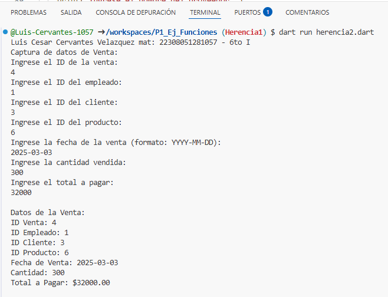
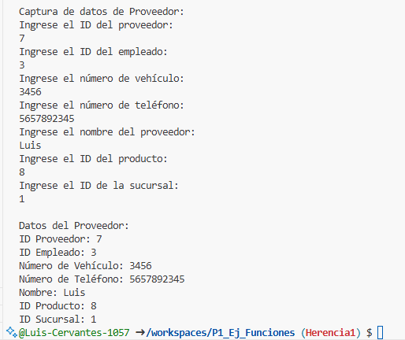

 - clase Venta con los atributos (id_venta, id_empleado, id_cliente, id_producto, fecha_venta, cantidad y total_pagar) 
con la funcion de CapturarDatos() pero que ineteractue con la interfaz, 
crear la clase DatosVenta con herencia Venta y una funcion de mostrarDatos(). lenguaje dart.
 - Agrega Clase Proveedor con los atributos (id_provee, id_empleado, num_vehiculo, num_tel, nombre, id_producto, id_sucursal) 
con la funcion de CapturarDatos() pero que ineteractue con la interfaz, 
crear la clase DatosProveedor con herencia Venta y una funcion de mostrarDatos(). lenguaje dart

