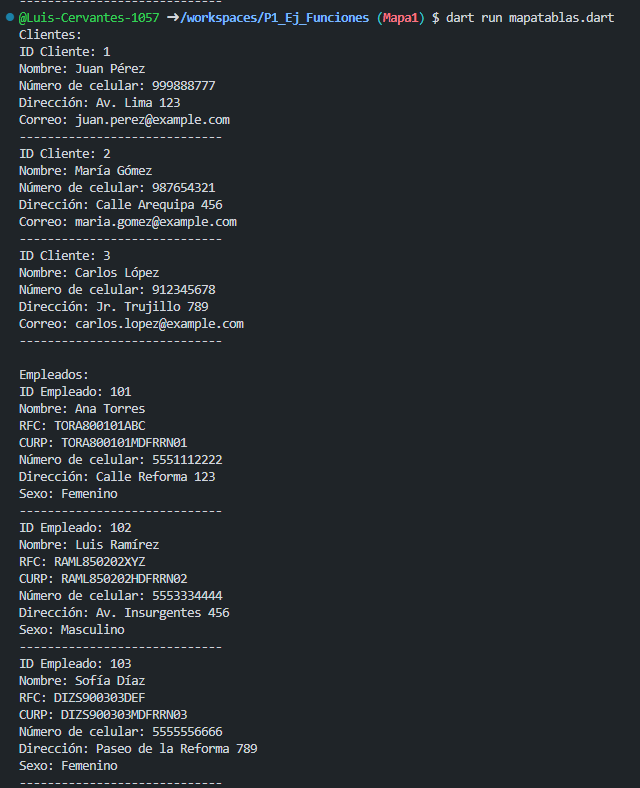
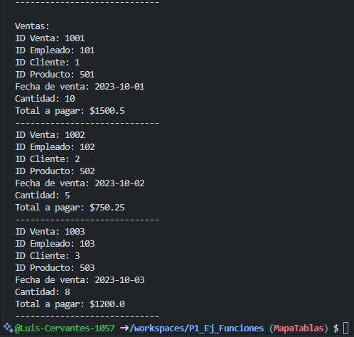

- crear map <string, dinamic> CocaCola con los siguientes keys, 
- Cliente va obtener los siguientes datos de id_cliente, nombre, apellido, num_celular, direccion y correo.
- Ahora de Empleados tendra id_empleado. nombre. apellido. rfc. curp. num_celular. direccion. sexo.                                
- Venta tendra id_venta. id_empleado. id_cliente. id_producto. fecha_venta. cantidad. total_pagar

